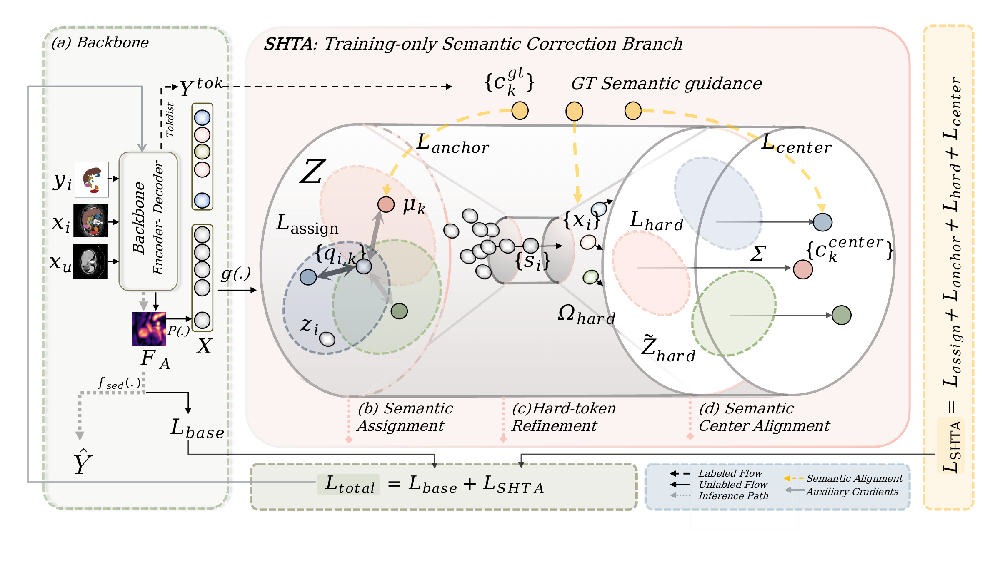

# SHTA

**SHTA: Semantic Hard Token Correction and Center Alignment for Semi-Supervised Medical Image Segmentation**<br>
Accepted at IEEE BIBM 2026 · [Paper (arXiv)](https://arxiv.org/abs/2607.07019)

Zhuoru Zhang, Yiheng Zhong, Zimu Zhang, and Xiaofeng Liu · Xi'an Jiaotong-Liverpool University and Yale University

SHTA adds a training-only semantic branch to CPS: **Semantic Assignment → Hard Token Refinement → Semantic Center Alignment**. It targets semantic ambiguity among selected hard tokens; the inference path remains the baseline segmentation network.



## Reproduce

The commands below reproduce the paper's Synapse 20%-labeled and AMOS 5%-labeled settings. Run them from the repository root on a Linux machine with a compatible NVIDIA/PyTorch environment.

### 1. Install

Use Python 3.10 and install the pinned dependencies:

```bash
conda create -n shta python=3.10 -y
conda activate shta
pip install -r requirements.txt
```

The requirements pin PyTorch 2.2 and torchvision 0.17. If your platform needs a CUDA-specific wheel, install the matching build from the official PyTorch selector before running the commands below.

The CPS base framework required by the launchers is included under `external/GALoss-main/`.

### 2. Prepare data

Download the datasets from the [Synapse/BTCV challenge](https://www.synapse.org/Synapse:syn3193805/wiki/) and [AMOS22](https://amos22.grand-challenge.org/). **This repository does not include raw-data download or raw-to-training-format conversion scripts.** Supply data already in these formats:

- **Synapse:** `0001.h5` … `0010.h5` and `0021.h5` … `0040.h5`, each containing `image` and `label` arrays. The 20%-labeled split is fixed in the trainer: labeled cases `0002, 0023, 0034, 0039`; validation cases `0006, 0025, 0026, 0040`; the remaining listed cases are training-unlabeled. Evaluation uses `0004, 0007, 0010, 0033, 0035, 0036`.
- **AMOS:** paired files named `amos_XXXX_image.npy` and `amos_XXXX_label.npy`, plus split files `labeled_5p.txt`, `unlabeled_5p.txt`, `eval.txt`, and `test.txt`. The trainer's `LABELNUM=10` selects the 5% split. Split-file entries must match the `XXXX` filenames.

Run only the check for the dataset you intend to use; it checks required files and the included base framework:

```bash
python check_setup.py --dataset synapse --synapse_root /data/Synapse
python check_setup.py --dataset amos --amos_root /data/AMOS --amos_split_dir /data/amos_splits
```

### 3. Train baseline and SHTA

Each launcher defaults to 17,000 iterations, seed 1337, and writes to `./model`. Override data/output paths with environment variables:

```bash
ROOT_PATH=/data/Synapse SAVE_PATH=./outputs bash run_ga_cps_3d_baseline_syn20.sh
ROOT_PATH=/data/Synapse SAVE_PATH=./outputs bash run_ga_cps_3d_v3_full_syn20.sh

ROOT_PATH=/data/AMOS SPLIT_DIR=/data/amos_splits SAVE_PATH=./outputs \
  bash run_ga_cps_3d_baseline_amos.sh
ROOT_PATH=/data/AMOS SPLIT_DIR=/data/amos_splits SAVE_PATH=./outputs \
  bash run_ga_cps_3d_v3_full_amos.sh
```

The six component-ablation launchers are `run_ga_cps_3d_v3_{proxyonly,hardonly,centeronly}_{clean_syn20,amos}.sh`; run them with the same dataset path variables to reproduce the corresponding ablations. `RUN_EXP`, `MAX_ITER`, and `GALOSS_PYTHON` can also be overridden.

### 4. Evaluate checkpoints

Training saves `best_A` and `best_B` in the run directory below; both are evaluated, and the SHTA auxiliary checkpoint is not used at inference.

```text
<SAVE_PATH>/<DATASET>_<RUN_EXP>_GA_<labelnum>labeled_seed_<seed>/
```

For example, evaluate the full SHTA Synapse run above; this selects the generated best checkpoints automatically:

```bash
RUN=./outputs/Synapse_CPS_syn20_v3full_3d_GA_4labeled_seed_1337
CKPT_A=$(find "$RUN" -maxdepth 1 -name '*_best_A.pth' -print -quit)
CKPT_B=$(find "$RUN" -maxdepth 1 -name '*_best_B.pth' -print -quit)
python test_best_3d_metrics.py --ga_root external/GALoss-main \
  --root_path /data/Synapse --run_dir "$RUN" \
  --ckpt_a "$CKPT_A" --ckpt_b "$CKPT_B" \
  --summary_txt ./outputs/synapse_test.txt
```

For AMOS, use the same pattern with `RUN=./outputs/AMOS_CPS_amos_v3full_3d_GA_10labeled_seed_1337` and run:

```bash
CKPT_A=$(find "$RUN" -maxdepth 1 -name '*_best_A.pth' -print -quit)
CKPT_B=$(find "$RUN" -maxdepth 1 -name '*_best_B.pth' -print -quit)
python test_best_amos_3d_metrics.py --ga_root external/GALoss-main \
  --root_path /data/AMOS --split_dir /data/amos_splits --run_dir "$RUN" \
  --ckpt_a "$CKPT_A" --ckpt_b "$CKPT_B" \
  --summary_txt ./outputs/amos_test.txt
```

Evaluate the baseline by pointing `RUN` to its run directory instead. Report mean and per-class Dice and ASD from the generated summaries.

## Scope and implementation

Datasets, trained checkpoints, logs, predictions, and raw-data conversion utilities are not distributed here. Results can vary with hardware, software, and data preprocessing; compare against the paper's protocol and report your actual run settings. The main implementation is `EPRL_latestv2.py`; training entry points are `train_Synapse_CPS_V3_3D.py` and `train_AMOS_CPS_V3_3D.py`; evaluation entry points are the two `test_best_*_metrics.py` files. `check_setup.py` checks local prerequisites.

## Citation and license

```bibtex
@inproceedings{zhang2026shta,
  title     = {SHTA: Semantic Hard Token Correction and Center Alignment for Semi-Supervised Medical Image Segmentation},
  author    = {Zhang, Zhuoru and Zhong, Yiheng and Zhang, Zimu and Liu, Xiaofeng},
  booktitle = {2026 IEEE International Conference on Bioinformatics and Biomedicine (BIBM)},
  year      = {2026},
  note      = {Accepted},
  url       = {https://arxiv.org/abs/2607.07019}
}
```

Citation metadata: `CITATION.cff`. License: MIT (`LICENSE`).
